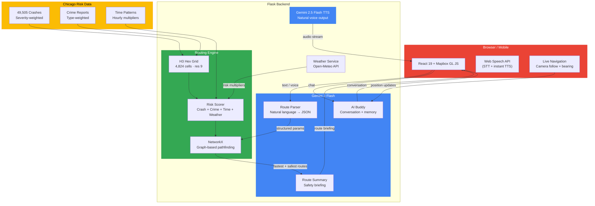

# SafePath

**Find safer routes through Chicago — because Google Maps won't tell you which streets to avoid at 2 AM.**

[Live Demo](https://safepath-calh.onrender.com/) | [Demo Video](#)

---

## The story behind this

All of us had just moved to Chicago. First month in the city, walking back from a friend's place around 11 PM. Didn't know the neighborhoods. Google Maps gave the "fastest route" — straight through a stretch that, as we later found out, had multiple assault incidents that same week. Nothing happened that night, but it easily could have.

And it's not just pedestrians. Chicago sees over **49,000 traffic crashes every six months**. Certain intersections — Wacker Dr, Ida B Wells Dr, O'Hare St — are crash magnets. Drivers blow through them every day because their GPS just says "turn left in 200 feet" without mentioning the intersection has a 95-crash-per-km density. Cyclists get it even worse — vulnerable to both traffic and crime, with no tool that accounts for either.

That stuck with us. Why doesn't navigation software care about *safety*? It optimizes for time, distance, tolls — but never once asks "hey, maybe don't take this route alone at midnight?" or "heads up, this intersection has a bad crash history."

So we built SafePath.

---

## What it actually does

 SafePath is a navigation app for Chicago that routes you around danger — not just traffic. It pulls **49,505 real crash records** and **thousands of crime reports** from Chicago's open data portal, maps them onto a street-level hex grid, and finds you a path that's actually safer.

The kicker? You lose maybe 2-3 extra minutes. That's it. For **40% less risk** on average.

It works for everyone on the road:

- **Drivers** — avoids high-crash intersections and accident-prone corridors. The app weights crash data at 90% because that's what actually kills drivers.
- **Pedestrians** — avoids both crime hotspots and dangerous crossings. Crime gets 70% weight because that's the real threat when you're on foot at night.
- **Cyclists** — balanced 50/50 between crash and crime risk, because on a bike you're exposed to both.

### Talk to it like a friend

No dropdowns. No forms. Just tell it where you want to go:

> *"Drive me from O'Hare to downtown, it's raining and rush hour"*
>
> *"Walk me from Millennium Park to Navy Pier, it's late and I'm alone"*
>
> *"Bike from Wicker Park to the Loop, morning commute"*

It picks up on everything. "Raining" triggers weather risk multipliers. "Rush hour" sets the time to peak crash density. "Alone" and "late" cranks safety priority way up. Then it gives you two routes — fastest and safest — and explains the tradeoff in plain English.

You can also just **call it**. Hit the phone icon and have a voice conversation. It sounds like a friend giving you directions, not a GPS robot.

### The risk isn't static

This is the part we're most proud of. Risk in SafePath isn't a fixed heatmap — it shifts constantly:

- **3 PM on a weekday** has **7x more crash risk** than 4 AM. The time slider lets you see this in real-time on the map.
- **Thunderstorm with hail?** That's a 1.7x risk multiplier on top of everything else. StreetWise checks live weather from Open-Meteo and adjusts.
- **Walking vs driving vs cycling** — completely different risk profiles. The AI picks the right mode from your words, or you can say it explicitly.

---

## How Gemini 3 powers this

Gemini isn't a bolt-on feature here — it's the brain of the entire app. We use **three Gemini capabilities** running in parallel:

**1. Gemini 3 Flash — Natural Language Route Parsing**
Every route request goes through Gemini 3 Flash to extract structured data from casual speech. It pulls out origin, destination, travel mode, time of day, and even safety concern level from a single sentence. "I'm walking alone from Wicker Park to the Loop at night" gets parsed into coordinates, mode=walking, hour=23, beta=8 (high safety priority). This replaces what would otherwise be a rigid form with dropdowns.

**2. Gemini 3 Flash — Conversational AI Buddy**
The AI buddy isn't just answering questions — it maintains conversation history, knows your current navigation state (position, next turn, distance remaining), integrates live weather context, and generates route summaries that mention actual Chicago streets and neighborhoods. During active navigation, it handles context-aware queries like "how much longer?" or "is this area safe?" using your real-time position.

**3. Gemini 2.5 Flash TTS — Voice Navigation**
Full voice call mode with natural speech output using the "Kore" voice. We run a two-tier alert system: Gemini TTS for advance turn warnings (20 seconds ahead, natural voice), and browser SpeechSynthesis for urgent alerts (10 seconds ahead, instant playback). The AI generates turn instructions that sound conversational — "slight left coming up on Michigan Ave" instead of "in 200 feet, turn left." *(Gemini 3 doesn't have TTS capability yet, so we use 2.5 Flash TTS for audio generation while all intelligence runs on Gemini 3.)*

All three run concurrently using `ThreadPoolExecutor` — route parsing and speculative chat happen in parallel so responses feel instant. The core application logic — everything that reasons, understands, and decides — runs on **Gemini 3 Flash**.

---

## Architecture



---

## How the routing works

Every street segment in Chicago sits inside an **H3 hexagonal cell** (resolution 9, about 0.1 km² each — roughly a city block). Each cell gets a risk score from 0-100 based on:

1. **Crash density** — 49,505 geocoded crashes, severity-weighted (fatal > injury > fender bender)
2. **Crime density** — street crimes filtered by type (homicide=10x weight, robbery=5x, theft=2x)
3. **Time pattern** — hourly multipliers from historical data
4. **Weather** — live conditions applied on top

The routing engine uses **NetworkX** with a custom cost function:

```
cost = travel_time + (beta * risk_score)
```

`beta` is how much you care about safety. Say "I'm with my kids" and beta goes to 9. Say "just get me there fast" and it drops to 0. The AI infers this from how you talk.

Two routes come back: fastest path and safest path. You see both on the map, pick one, and start navigating — Google Maps style with camera follow, bearing rotation, and turn-by-turn voice.

---

## The numbers

| | |
|---|---|
| Crash records analyzed | **49,505** (Aug 2025 — Feb 2026) |
| H3 grid cells | **4,824** covering all of Chicago |
| Data quality score | **100/100** (fully geocoded + temporal) |
| Peak-to-low risk ratio | **7.04x** (3 PM vs 4 AM) |
| Typical risk reduction | **~40%** for 2-3 min extra |
| Most dangerous density | **95 crashes/km** (O'Hare St) |
| Grid resolution | **0.1 km²** per cell (street-level) |

---

## Features

**Navigation**
- Google Maps-style live navigation with camera follow + bearing rotation
- Turn-by-turn voice directions with 10-second advance warnings
- Works for walking, driving, and cycling — each with mode-specific risk weighting
- Demo mode to simulate a route without GPS
- Works on mobile — optimized for 10fps rendering

**AI Buddy (Gemini 3)**
- Natural language route requests — text or voice
- Conversational AI with Chicago street knowledge and memory
- Context-aware: detects time, weather, travel mode, safety concern level from your words
- Voice calls with interrupt support — tap to cut in anytime
- Off-route detection with instant re-routing alerts
- Parallel parse + chat for sub-second response times

**Visualization**
- Live risk heatmap with hour-of-day slider
- Side-by-side fastest vs safest route comparison
- Weather badge with real-time conditions
- Risk metrics overlay (crash %, crime %, time multiplier)

---

## Tech stack

| Layer | Tech |
|-------|------|
| Frontend | React 19, react-map-gl, Mapbox GL JS, Framer Motion |
| Backend | Flask, NetworkX, OSMnx, GeoPandas, H3 |
| AI | Google Gemini 3 Flash (chat + parse), Gemini 2.5 Flash TTS |
| Data | Chicago Data Portal (crashes + crimes), Open-Meteo (weather) |
| Spatial | H3 hexagonal grid (res 9), Haversine distance, Mapbox geocoding |
| Deploy | Render (gunicorn + static build) |

---

## Run it locally

**Backend**
```bash
cd risk_aware_routing
pip install -r requirements.txt
# Add your keys to .env:
#   GEMINI_API_KEY=your_key
#   MAPBOX_TOKEN=your_token
python app.py
```

**Frontend**
```bash
cd frontend
npm install
# Add to .env:
#   VITE_MAPBOX_TOKEN=your_token
npm run dev
```

Open `http://localhost:5173` and try:
- *"Drive from O'Hare to Millennium Park during rush hour"*
- *"Walk from Willis Tower to Wrigley Field at night"*
- *"Bike from Logan Square to the Loop, it's raining"*

---

## What we'd build next

- Expand beyond Chicago (the pipeline is city-agnostic, just needs open crash/crime data)
- Community reports — let users flag sketchy areas in real-time
- Historical "safe walk" patterns from anonymized GPS traces
- Integration with city emergency services for live incident avoidance
- Real-time traffic incident feeds for drivers
- Offline mode with pre-cached risk tiles

---

## Why this matters

Every year, thousands of pedestrians, cyclists, and drivers are injured on Chicago streets. Most of them were just going somewhere — to work, to a friend's place, home from a bar, picking up their kids. The data to avoid the worst streets already exists. It's public. It's free. Nobody was using it to help people navigate.

Now we are.

---

*Built for the Gemini 3 Hackathon 2026*
